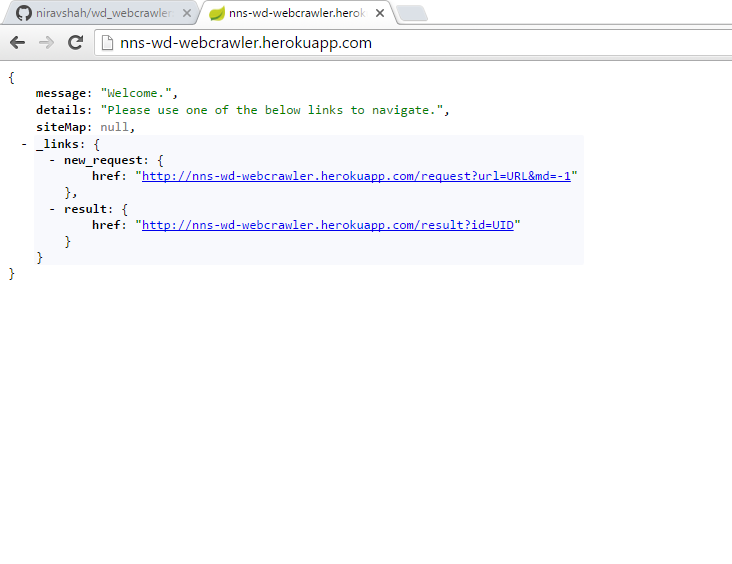
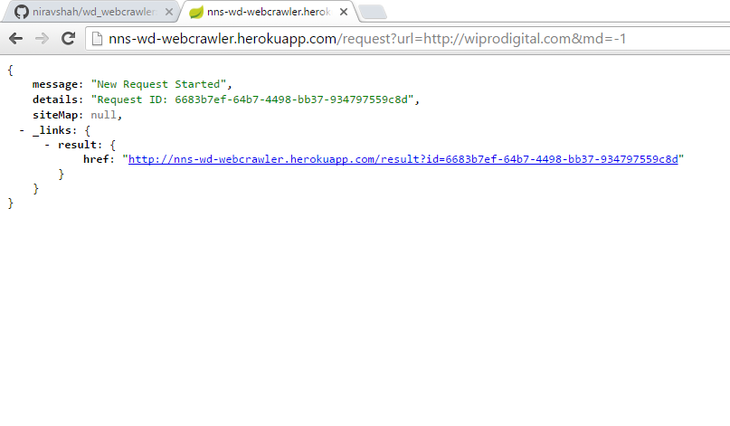

# Java Web Crawler

This web crawler has been implemented using the Java Fork Join pattern.
A Hypermedia based REST API provides access to the crawler through the browser or any other REST client.
The API has been implemented using Spring Boot.

The REST API receives Crawling requests and queues them to Redis.
A Redis Consumer triggers the Fork Join pool to process new requests and constantly updates the status of ongoing requests.

**Continuous Integration**

The project has been integrated with **Travis CI**. Builds are triggered on every push to Github.

https://travis-ci.org/niravshah/wd_webcrawler

**Continuous Delivery**

Successful builds are deployed to Heroku. The HATEOAS API can be access via the below URL

https://nns-wd-webcrawler.herokuapp.com/

### Prerequisities

**Redis** - The project can be checked out and run localy. It needs a default Redis Install. When running on Heroku, the VM has been provisioned with Redis already.

### Installing

**Heroku**

Travis CI installs the app on Heroku. It can be accessed at below URL

```
https://nns-wd-webcrawler.herokuapp.com/
```

**Local**
Checkout the project from Github and run the CrawlerApplication.java file. This will bootstrap the Spring Boot API.

You can access the local API at

```
http://localhost:8080
```

## API

The API exposes three Hypermedia driven REST endpoints.

1. Home
2. Request
3. Result

**Home Resource**

This acts as the landing page and provides the key hypermedia definitions for any client wanting to explore the API further

Example Urls:

```
https://nns-wd-webcrawler.herokuapp.com/
http://localhost:8080/
```

**Request Resource**

This resource accepts new crawling requests and queues them to Redis.
A Redis Receiver then triggers the Fork Join pool to crawl the URL

This resource accepts two parameters:
1. url - The URL that needs to be crawled
2. md - Max Depth for crawling. A value of -1 crawls the whole domain.

```
https://nns-wd-webcrawler.herokuapp.com/request?url=http://wiprodigital.com&md=-1
http://localhost:8080/request?url=http://wiprodigital.com&md=-1
```
The endpoint will return a **Request ID** which can be used to track progress.

**Result Resource**

This resource gives the current status of the Request.
If the crawling is complete, then it will display the sitemap.
If the crawling is in progress, then it will give the a continuously updating snapshot of the number of links indexed.

This resource accepts one parameter.
1. id - This is the request id

```
https://nns-wd-webcrawler.herokuapp.com/result?id=b4dee211-c03f-48da-ad6c-f0e107e99aab
http://localhost:8080/result?id=b4dee211-c03f-48da-ad6c-f0e107e99aab
```
## Usage Example

**Home Resource**



**New Request Resource**



## Authors

* **Nirav Shah**